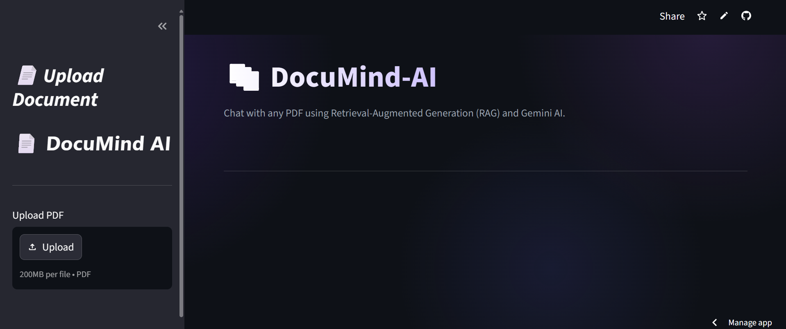
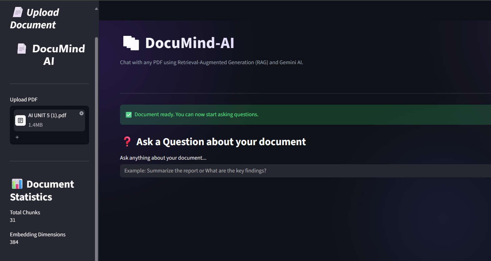
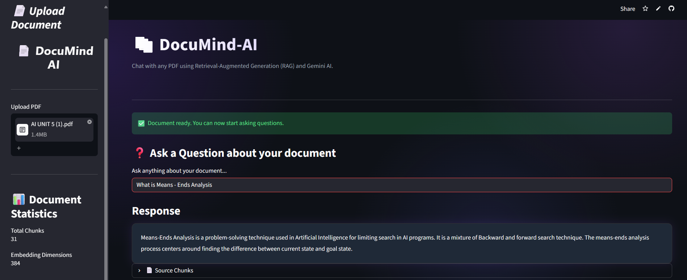
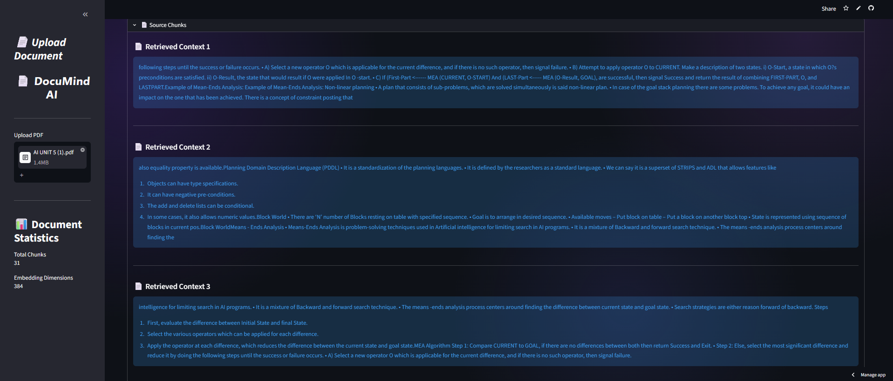

# 📚 DocuMind-AI

An AI-powered document assistant that allows users to chat with PDF documents using **Retrieval-Augmented Generation (RAG)**. Upload any PDF, ask natural language questions, and receive context-aware answers powered by **Google Gemini AI** with semantic search using **FAISS** and **Sentence Transformers**.

---

## 🚀 Live Demo

🔗 **Live App:** *https://docu-mind-chat.streamlit.app/*

---

## ✨ Features

- 📄 Upload and process PDF documents
- 🧠 Intelligent text chunking
- 🔍 Semantic search using FAISS vector database
- 🤖 Context-aware answers powered by Google Gemini AI
- 📌 Source chunk citations for answer transparency
- ⚡ Faster processing using Streamlit caching
- 🎨 Clean and modern user interface

---

## 📸 Screenshots

### 🏠 Home Page



---

### 📄 Upload PDF



---

### 🤖 AI Response



---

### 📌 Source Chunks



---

# 🏗️ Project Architecture

```text
               User Uploads PDF
                      │
                      ▼
             PDF Text Extraction
                      │
                      ▼
             Recursive Text Chunking
                      │
                      ▼
     Sentence Transformer Embeddings
                      │
                      ▼
          FAISS Vector Database
                      │
         User asks a Question
                      │
                      ▼
      Semantic Similarity Search
                      │
                      ▼
      Relevant Context Retrieved
                      │
                      ▼
         Google Gemini AI (LLM)
                      │
                      ▼
     Context-Aware Answer + Sources
```

---

# 🛠️ Tech Stack

### Programming Language
- Python

### Framework
- Streamlit

### AI / Machine Learning
- Google Gemini API
- Sentence Transformers
- LangChain

### Vector Database
- FAISS

### PDF Processing
- PyPDF

### Version Control
- Git
- GitHub

---

# 📂 Project Structure

```text
DocuMind-AI/
│
├── app.py
├── requirements.txt
├── README.md
├── images/
│   ├── home.png
│   ├── upload.png
│   ├── answer.png
│   └── citations.png
│
├── utils/
│   ├── chatbot.py
│   ├── embeddings.py
│   ├── llm.py
│   ├── pdf_loader.py
│   ├── text_splitter.py
│   └── vector_store.py
│
├── uploads/
└── vectorstore/
```

---

# ⚙️ Installation

Clone the repository

```bash
git clone https://github.com/Athira286/DocuMind-AI.git
```

Move into the project directory

```bash
cd DocuMind-AI
```

Install dependencies

```bash
pip install -r requirements.txt
```

Create a `.env` file

```env
GOOGLE_API_KEY=YOUR_API_KEY
```

Run the application

```bash
streamlit run app.py
```

---

# 💡 How It Works

1. Upload a PDF document.
2. The application extracts the document text.
3. The text is divided into smaller chunks.
4. Sentence Transformers convert each chunk into vector embeddings.
5. FAISS stores the embeddings for efficient semantic search.
6. When a user asks a question:
   - The query is embedded.
   - The most relevant chunks are retrieved.
   - Gemini AI generates an answer using the retrieved context.
7. The application displays both the answer and the supporting source chunks.

---

# 🔮 Future Improvements

- Multi-PDF support
- Persistent chat history
- Highlight relevant text directly inside the PDF
- Export chat conversations
- User authentication
- Cloud vector database integration

---

# 👩‍💻 Author

**Athira**

GitHub: https://github.com/Athira286

---

## ⭐ If you found this project useful, consider giving it a star!